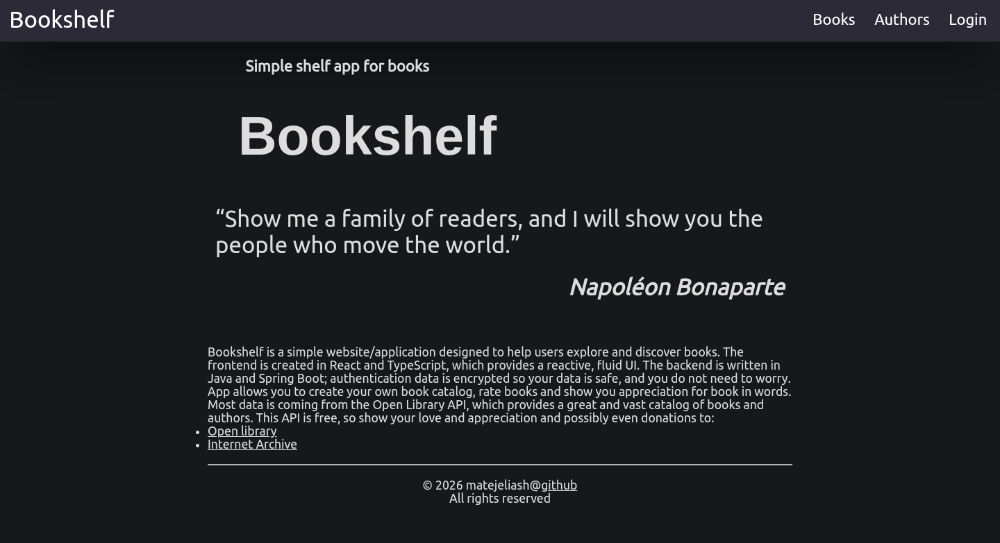
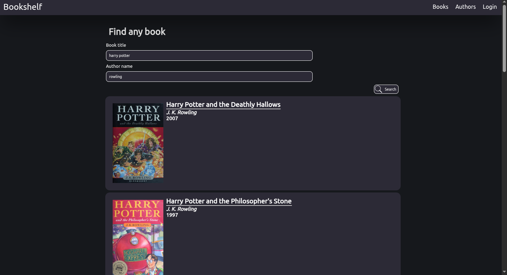
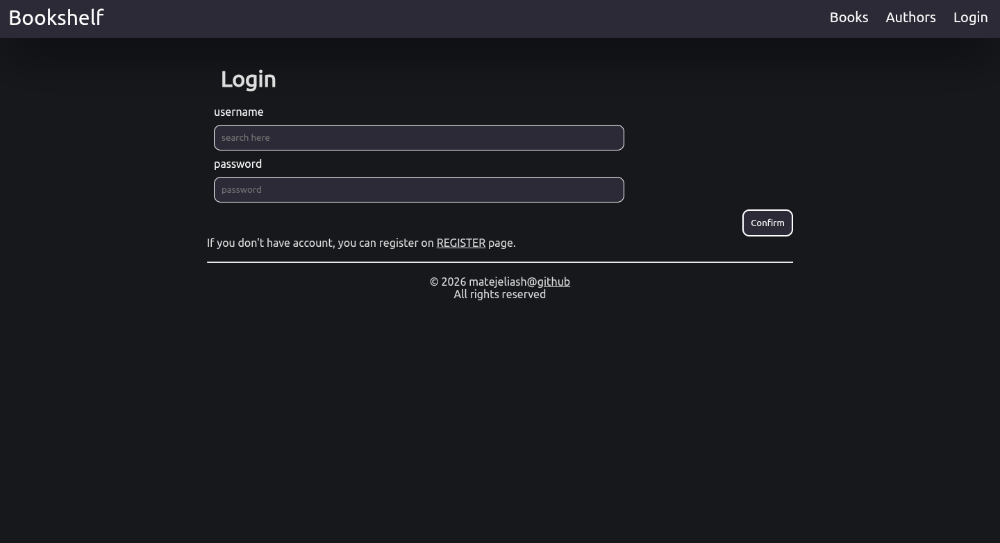

# bookshelf

Simple website that allows you to search books using OpenLibraryAPI and like, rate, and review books. Backend is written in Java using Spring Boot. Frontend is written in React and uses Typescript.

## !!! Under heavy development !!!

I worked only few hours on website frontend, code is ugly, no comments yet and heavy code duplication. Frontend will be completly changed and extended.

## Images

